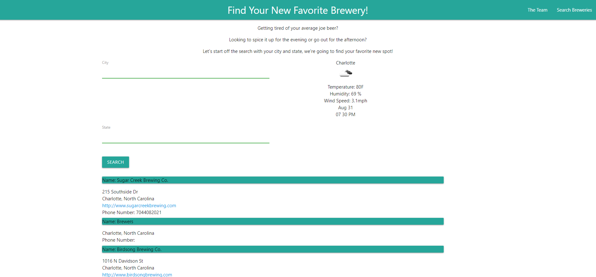

# FirstProject

Crystal, Jesse and I decided to make a "Find Your Brewery" website for our first project. For this project, we wanted to make a site where when you type in a city and state you are located in, breweries in that location will pop up with their address and location. 

User Story: 
	As a customer, I want to be able to type in my location
	As a customer, I want to see what breweries are in my location.
	As a customer, I want to be able to access the address of my local breweries. 
  As a customer, I want to be able to have access to the websites of my local breweries. 
  
  Links:
  Repository: https://github.com/jameslee70/FirstProject
  Deployed app: https://jameslee70.github.io/FirstProject/
  
  
  
